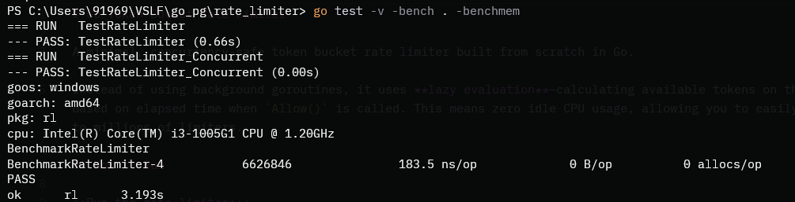

# Go Token Bucket Rate Limiter

A minimal, concurrency-safe token bucket rate limiter built from scratch in Go. 

Instead of using background goroutines, it uses **lazy evaluation** calculating available tokens on the fly based on elapsed time when `Allow()` is called. This means zero idle CPU usage, allowing you to easily scale to millions of limiters.

## How to Run

**Run the rate limiter:**
```bash
go run .
```
**Run the tests:**
```bash
go test
```

**Run the benchmarks:**
```bash
go test -v -bench . -benchmem
```
## Current Benchmark Results (on Intel i3):

- Speed: ~183.5 ns/op (handles ~5.4 million requests per second on a single limiter)

- Memory: 0 B/op, 0 allocs/op (zero garbage collection pressure)


